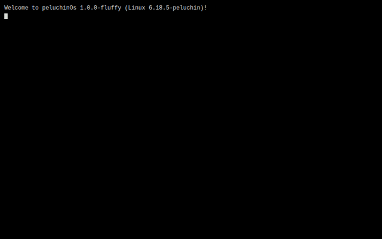

# peluchinOs

A Windows 98/2000-flavoured desktop that boots like Linux, built with modern
web tech and shipped three ways: as a web app, a native desktop app, and a
**bootable Live ISO** that turns any PC or VM into a peluchinOs box.



## What it is

peluchinOs is a retro desktop environment running in a browser engine. It has
a real window manager, a virtual filesystem, a working MS-DOS-style terminal
with ~50 commands, and a handful of apps — all faithful to the beige-and-teal
Win98/2000 look, on top of a Linux-style boot sequence that runs genuine
self-tests before the desktop appears.

It is **not** a from-scratch kernel. The Live ISO is a real Debian trixie
system (Linux 6.12) whose only visible face is the peluchinOs shell running
fullscreen in a WebKit kiosk — the same pattern SteamOS, ChromeOS and friends
use. Drop to a tty (`Ctrl+Alt+F2`) and you get a full Debian userspace with
real `apt` and `dpkg`.

## Try it

### Web (fastest)

```bash
npm install
npm run dev        # http://localhost:1420
```

### Native desktop app (Tauri)

```bash
npm run tauri build      # produces .deb / .rpm / .AppImage
```

Needs the Tauri Linux prerequisites: `libwebkit2gtk-4.1-dev libgtk-3-dev
libayatana-appindicator3-dev librsvg2-dev libssl-dev`.

### Bootable Live ISO

Grab `peluchinOs-live.iso` from the [latest release](../../releases/latest) and:

```bash
# In a VM
qemu-system-x86_64 -m 2G -cdrom peluchinOs-live.iso

# Or write it to a USB stick and boot a real machine
sudo dd if=peluchinOs-live.iso of=/dev/sdX bs=4M conv=fsync status=progress
```

**VirtualBox note:** any graphics controller works — the default GRUB entry
uses a universal VESA mode. VMSVGA with 128 MB video memory gives the best
result. Leave EFI off.

Prefer zero setup? Grab **`peluchinOs.ova`** from the release instead:
_File → Import Appliance_ in VirtualBox, then Start. It comes pre-configured
(2 GB RAM, 2 vCPU, VMSVGA, SATA disk) so nothing needs tweaking.

Build the images yourself:

```bash
sudo scripts/build-iso.sh    # -> iso-build/peluchinOs-live.iso
sudo scripts/build-ova.sh    # -> iso-build/peluchinOs.ova
```

(needs `mmdebstrap squashfs-tools xorriso grub-pc-bin grub-efi-amd64-bin
qemu-utils` and a Tauri `.deb` already built.)

## Apps

| App | What it does |
|-----|--------------|
| **Terminal** | MS-DOS-style shell, ~50 commands, pipes, `>` `>>` `<` redirects, tab completion, history, `apt`/`dpkg` package manager |
| **File Explorer** | Two-pane browser over the virtual filesystem, live-updating |
| **Notepad** | Text editor that reads/writes the VFS |
| **Paint** | 8 tools, 20-colour palette, flood fill, undo/redo, saves PNG |
| **Minesweeper** | 3 difficulties, first click always safe |
| **Solitaire** | Full Klondike |
| **Event Viewer** | Live kernel log with level/source filters and JSON export |

Keyboard: `F2` spawns a demo log entry · `F3` opens Event Viewer ·
`Ctrl+Alt+Del` triggers the BSOD easter egg.

## Architecture

```
src/
├── kernel/          logger · window-manager · vfs (Dexie/IndexedDB) ·
│                    probes · audio (Web Audio) · system · host (Tauri bridge)
├── shell/           boot · desktop · taskbar · start-menu · window ·
│                    context-menu · bsod · shutdown
└── apps/            terminal · file-explorer · notepad · paint ·
                     minesweeper · solitaire · event-viewer
src-tauri/           Rust backend — host_info / host_read_file /
                     host_write_file / host_list_dir, all behind a path
                     allowlist ($HOME + /tmp)
scripts/build-iso.sh mmdebstrap → squashfs → grub-mkrescue hybrid ISO
```

Stack: React 19 · Vite 6 · TypeScript · Tailwind v4 · Zustand · Dexie ·
Tauri 2 · Biome.

## Boot self-tests

The boot screen isn't a fixed animation — each `[ OK ]` line is a real probe
that exercises a subsystem (logger buffer, event bus, window manager
open/close, app registry, theme tokens, `requestAnimationFrame`, Web Crypto,
localStorage, IndexedDB round-trip, the plush filesystem, the Tauri host
bridge). Failures print in red with the cause; the run ends with a
`systemd`-style `Startup finished in N.NNNs — X ok, Y warn, Z failed.`

## License

[MIT](LICENSE) © 2026 peluchinOs contributors.
